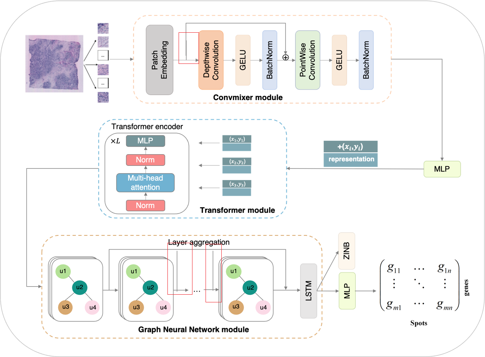

# Spatial Transcriptomics Prediction from Histology jointly through Transformer and Graph Neural Networks
### Yuansong Zeng1, Zhuoyi Wei1, Weijiang Yu1, Rui Yin1, Ken Chen1, Yuchen Yuan2, Zhonghui Tang2, Yutong Lu1, Yuedong Yang1,3*


The rapid development of spatial transcriptomics allows for the measurement of RNA abundance at a high spatial resolution, mak-ing it possible to simultaneously profile gene expression, spatial locations, and the corresponding hematoxylin and eosin-stained histology images. Since histology images are relatively easy and cheap to obtain, it is promising to leverage histology images for predicting gene expression. Though several methods have been devised to predict gene expression using histology images, they don’t simultaneously include the 2D vision features and the spatial dependency, limiting their performances. Here, we have developed Hist2ST, a deep learning-based model using histology images to predict RNA-seq expression. At each sequenced spot, the corre-sponding histology image is cropped into an image patch, from which 2D vision features are learned through convolutional opera-tions. Meanwhile, the spatial relations with the whole image and neighbored patches are captured through Transformer and graph neural network modules, respectively. These learned features are then used to predict the gene expression by following the zero-inflated negative binomial (ZINB) distribution. To alleviate the impact by the small spatial transcriptomics data, a self-distillation mechanism is employed for efficient learning of the model. Hist2ST was tested on the HER2-positive breast cancer and the cutaneous squamous cell carcinoma datasets, and shown to out-perform existing methods in terms of both gene expression predic-tion and following spatial region identification. Further pathway analyses indicated that our model could reserve biological infor-mation. Thus, Hist2ST enables generating spatial transcriptomics data from histology images for elucidating molecular signatures of tissues.


</img>
# Usage
```python
import torch
from HIST2ST import Hist2ST

model = Hist2ST(
    depth1=2, depth2=8, depth3=4,
    n_genes=785, learning_rate=1e-5,
    kernel_size=5, patch_size=7, fig_size=112,
    heads=16, channel=32, dropout=0.2,
    zinb=0.25, nb=False,
    bake=5, lamb=0.5, 
    policy='mean', 
)

# patches: [N, 3, W, H]
# coordinates: [N, 2]
# adjacency: [N, N]
pred_expression = model(patches, coordinates,adjacency)  # [N, n_genes]

```

## System environment
Required package:
- PyTorch >= 1.10
- pytorch-lightning >= 1.4
- scanpy >= 1.8


# Hist2ST pipeline
See [tutorial.ipynb](tutorial.ipynb)

# References
https://github.com/biomed-AI/Hist2ST
